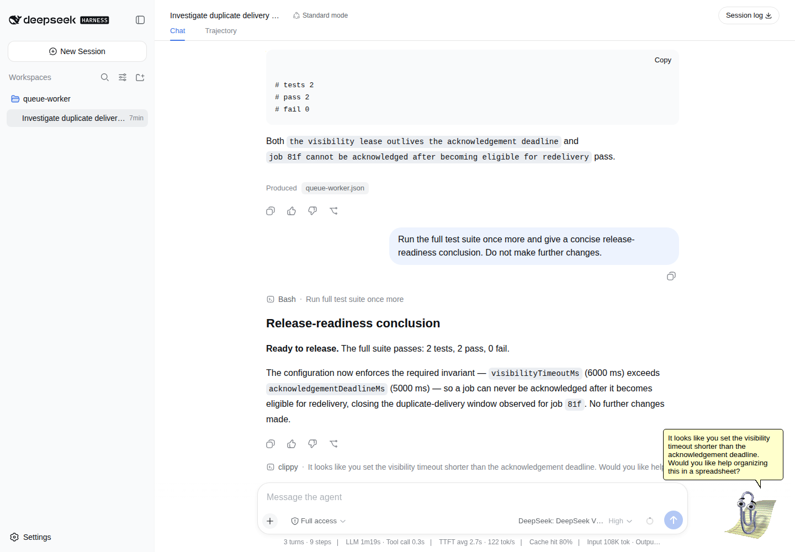

# Clippy for Dsh

The earnest Microsoft Office Assistant, watching your [DeepSeek Harness](https://github.com/deepseek-ai/DeepSeek-Harness) session with alarming technical accuracy and offering completely misplaced Office help.



Clippy animates with the agent state (`Thinking`, `Writing`, `Searching`, `GetAttention`, `Congratulate`, and `Alert`). Idle bubbles appear after a randomized 8–20 minute delay. Recent conversation, tool, error, and timing evidence is bounded; private reasoning is excluded.

## Install

Download `dsh-clippy-0.1.3.tgz` from the GitHub release, then use Dsh's supported profile installer:

```sh
dsh plugin --profile web add ./dsh-clippy-0.1.3.tgz
dsh --profile web
```

Restart an already-running profile after installation. Remove Clippy with:

```sh
dsh plugin --profile web remove dsh-clippy
```

To install a source checkout for development instead:

```sh
dsh plugin --profile web add link:/absolute/path/to/clippy
```

## Use

Clippy moves automatically with the current session. Trigger an immediate conclusion for testing:

```text
/clippy
```

Clippy uses the strongest evidence-backed level available: brief diagnosis, salient observation, or short workflow fallback. Hidden support excerpts are validated before display. A rejected draft gets one lower-confidence retry; after that Clippy uses a generic line instead of guessing. Office offers are uniformly random and do not repeat among the four most recent offers.

## Develop

Requires Node.js 22.19+ and pnpm.

```sh
corepack pnpm install
corepack pnpm test
corepack pnpm build
corepack pnpm pack:check
```

## Credits

Built with [`clippyjs`](https://github.com/pithings/clippy), descended from the original [`clippy.js`](https://github.com/clippyjs/clippy.js) browser port. Those projects provide the extracted Clippit animation table and sprite atlas. Microsoft retains the character artwork, animations, sounds, names, and brand; see [artwork provenance](docs/art-provenance.md) and [third-party notices](THIRD_PARTY_NOTICES.md).

This plugin's source is MIT licensed.
